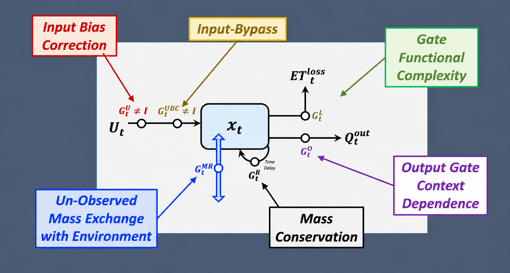

# Mass-Conserving Perceptron (MCP) SingleNode Model Zoo

This repository presents a cleaned, refactored, documented, and reorganized version of the research code originally released on [Zenodo](https://zenodo.org/records/10002551), with assistance from OpenAI's ChatGPT (GPT-5.6 Sol, High reasoning mode).

The original code was developed for the experiments reported in Wang & Gupta (2024), while this repository restructures those implementations into a more usable, reproducible, and maintainable model zoo.

It contains single-node **Mass-Conserving Perceptron (MCP)** model variants, together with cleaned training and evaluation scripts, historical checkpoints, standardized model notation, and documented execution conventions for model reproduction, continuation, fine-tuning, and further development.

Readers are encouraged to consult the original paper for the formal model names, notation, and mathematical definitions associated with each MCP variant.

- Full article: [Wang & Gupta (2024)](https://agupubs.onlinelibrary.wiley.com/doi/full/10.1029/2023WR036461)
- DOI: [10.1029/2023WR036461](https://doi.org/10.1029/2023WR036461)

> Wang, Y.-H. and Gupta, H.V. (2024). *A mass-conserving-perceptron for machine-learning-based modeling of geoscientific systems*. Water Resources Research, 60(4), e2023WR036461.

## Conceptual overview of a single-node MCP

The figure below illustrates the functional components and modeling utilities that can be represented within a single-node MCP, including: 
- input bias correction
- input bypass
- gate functional complexity
- output-gate context dependence 
- unobserved mass exchange with the environment
- mass conservation.

<p align="center">
  
</p>

*Conceptual illustration of the functional components and modeling utilities represented in a single-node MCP.*

---

## 1. Notation

The model notation used throughout the repository is:

| Symbol | Meaning |
|---|---|
| $O$ | Output gate |
| $L$ | Loss gate |
| $R$ | Remember gate |
| $\kappa$ | Constant gate |
| $\sigma$ | Sigmoid-based time-variable gate |
| $\mathrm{con}$ | PET-constrained loss gate |
| $B_{Lx}$ | Piecewise-linear precipitation bias-correction gate with dimension $x$ |
| $B_{Qx}$ | Piecewise-quadratic precipitation bias-correction gate with dimension $x$ |
| $A_x$ | Single hidden ANN layer with $x$ nodes |
| $+$ | Multi-information (MI): the gate uses additional state information |
| MR | Mass-relaxation mechanism |

---

## 2. Base single-node MCP models

The basic family contains constant ($\kappa$) and sigmoid-variable ($\sigma$) output/loss gates. 

For variable gates, the output gate depends on the current storage state and the loss gate depends on current PET.

| Model | Notation | Description | MCP_Zoo class |
|---|---|---|---|
| M1 | $\mathrm{MC}\lbrace O_{\kappa}L_{\kappa}\rbrace$ | Constant output + constant loss | `MCPBRNN_constant_OutLoss` |
| M2 | $\mathrm{MC}\lbrace O_{\kappa}L_{\sigma}\rbrace$ | Constant output + PET-variable loss | `MCPBRNN_Generic_constant_Out_variableLoss` |
| M3 | $\mathrm{MC}\lbrace O_{\sigma}L_{\kappa}\rbrace$ | Storage-variable output + constant loss | `MCPBRNN_Generic_variable_Out_constantLoss` |
| M4 | $\mathrm{MC}\lbrace O_{\sigma}L_{\sigma}\rbrace$ | Storage-variable output + PET-variable loss | `MCPBRNN_Generic_Scaling` |
| M5 | $\mathrm{MC}\lbrace O_{\sigma}L_{\sigma}^{\mathrm{con}}\rbrace$ | M4 + PET-constrained loss | `MCPBRNN_Generic_PETconstraint_Scaling` |

Historical checkpoint references:

| Model | Historical checkpoint |
|---|---|
| M1 | `model_epoch42.pt` |
| M2 | `model_epoch468.pt` |
| M3 | `model_epoch4963.pt` |
| M4 | `model_epoch48.pt` |
| M5 | `model_epoch27.pt` |

---

## 3. Precipitation bias-correction models

These models extend M5 with a precipitation-dependent bias-correction function.

For both model families below, **M1–M5 indicate the dimensionality of the bias-correction function**, with dimensions ranging from 1 to 5. They do **not** refer to the five base MCP models described in Section 2.

### 3.1 Piecewise-linear correction: `M-IBCorrPL`

The model family is denoted as

$MC\lbrace O_{\sigma}L_{\sigma}^{con}B_{Lx}\rbrace,\quad x=1,\ldots,5$

where $B_{Lx}$ represents a piecewise-linear precipitation bias-correction function with dimension $x$.

Accordingly:

- `M1-IBCorrPL` corresponds to $B_{L1}$
- `M2-IBCorrPL` corresponds to $B_{L2}$
- `M3-IBCorrPL` corresponds to $B_{L3}$
- `M4-IBCorrPL` corresponds to $B_{L4}$
- `M5-IBCorrPL` corresponds to $B_{L5}$

### 3.2 Piecewise-quadratic correction: `M-IBCorrPQ`

The model family is denoted as

$MC\lbrace O_{\sigma}L_{\sigma}^{con}B_{Qx}\rbrace,\quad x=1,\ldots,5$

where $B_{Qx}$ represents a piecewise-quadratic precipitation bias-correction function with dimension $x$.

Accordingly:

- `M1-IBCorrPQ` corresponds to $B_{Q1}$
- `M2-IBCorrPQ` corresponds to $B_{Q2}$
- `M3-IBCorrPQ` corresponds to $B_{Q3}$
- `M4-IBCorrPQ` corresponds to $B_{Q4}$
- `M5-IBCorrPQ` corresponds to $B_{Q5}$

Folders:

```text
M-IBCorrPL/
├── M1-IBCorrPL/
├── M2-IBCorrPL/
├── M3-IBCorrPL/
├── M4-IBCorrPL/
└── M5-IBCorrPL/

M-IBCorrPQ/
├── M1-IBCorrPQ/
├── M2-IBCorrPQ/
├── M3-IBCorrPQ/
├── M4-IBCorrPQ/
└── M5-IBCorrPQ/
```

---

## 4. Mass-relaxation models

These models extend M5 by incorporating a mass-relaxation (MR) mechanism.

The four MR variants are:

| Model | Notation | Description |
|---|---|---|
| MR-1 | $MC\lbrace O_{\sigma}L_{\sigma}^{\mathrm{con}}M_{\sigma}^{R}\rbrace$ | Regular |
| MR-2 | $MC\lbrace O_{\sigma}L_{\sigma}^{\mathrm{con}}M_{I}^{R}\rbrace$ | Independent |
| MR-3 | $MC\lbrace O_{\sigma}L_{\sigma}^{\mathrm{con}}M_{\sigma r}^{R}\rbrace$ | Regular-Relaxed |
| MR-4 | $MC\lbrace O_{\sigma}L_{\sigma}^{\mathrm{con}}M_{Ir}^{R}\rbrace$ | Independent-Relaxed |

Folders:

```text
MR-1/
MR-2/
MR-3/
MR-4/
```

---

## 5. Complex gate models: `M-ComplexGate`

$A_x$ denotes a one-hidden-layer ANN with $x=1,\ldots,5$ hidden nodes.

### 5.1 LossGateOnly

The model family is denoted as

$MC\lbrace O_{\sigma}L_{A_x}^{\mathrm{con}}\rbrace,\quad x=1,\ldots,5$

Folder structure:

```text
M-ComplexGate/
└── LossGateOnly/
    ├── loss-dim-1/
    ├── loss-dim-2/
    ├── loss-dim-3/
    ├── loss-dim-4/
    └── loss-dim-5/
```

Class:

```python
MCPBRNN_Generic_LossANNGate_PETconstraint
```

The output gate is storage-dependent sigmoid. The loss gate is a PET-driven ANN.

### 5.2 OutputGateOnly

The model family is denoted as

$MC\lbrace O_{A_x}L_{\sigma}^{\mathrm{con}}\rbrace,\quad x=1,\ldots,5$

Folder structure:

```text
M-ComplexGate/
└── OutputGateOnly/
    ├── output-dim-1/
    ├── output-dim-2/
    ├── output-dim-3/
    ├── output-dim-4/
    └── output-dim-5/
```

Class:

```python
MCPBRNN_Generic_OutputANNGate_PETconstraint
```

The output gate is a storage-driven ANN. The loss gate remains PET-dependent sigmoid.

### 5.3 BothLossOutputGate

The model family is denoted as

$MC\lbrace O_{A_x}L_{A_y}^{\mathrm{con}}\rbrace,\quad x,y=1,\ldots,5$

There are 25 combinations:

```text
loss-dim-1-out-dim-1
...
loss-dim-5-out-dim-5
```

Here, $x$ and $y$ denote the dimensions of the output-gate and loss-gate ANN functions, respectively.

Class:

```python
MCPBRNN_Generic_ANNGate_PETconstraint_Generic
```

The output and loss gates each use a one-hidden-layer ANN.

---

## 6. Multi-information complex gate models: `M-MI-ComplexGate`

MI means that a gate uses additional information beyond its standard current-time input.

For the current implementation:

- the **output gate** can use current storage plus lagged storage ($t-1$);
- the **loss gate** can additionally use current storage information;
- the superscript $^{+}$ denotes the MI extension.

### 6.1 LossGateOnly

The model family is denoted as

$MC\lbrace O_{\sigma}L_{A_x^{+}}^{\mathrm{con}}\rbrace,\quad x=1,\ldots,5$

Class:

```python
MCPBRNN_Generic_PETconstraint_MIloss
```

### 6.2 OutputGateOnly

The model family is denoted as

$MC\lbrace O_{A_x^{+}}L_{\sigma}^{\mathrm{con}}\rbrace,\quad x=1,\ldots,5$

Class:

```python
MCPBRNN_Generic_PETconstraint_MIoutput
```

### 6.3 BothLossOutputGate

The model family is denoted as

$MC\lbrace O_{A_x^{+}}L_{A_y^{+}}^{\mathrm{con}}\rbrace,\quad x,y=1,\ldots,5$

There are 25 combinations.

Here, $x$ and $y$ denote the dimensions of the output-gate and loss-gate ANN functions, respectively.

Class:

```python
MCPBRNN_Generic_PETconstraint_MIoutputloss
```

### 6.4 MI-Only sigmoid models

These cases use direct sigmoid gates instead of ANN hidden layers.

| Folder | Notation | Class |
|---|---|---|
| `loss-gate-only/` | $MC\lbrace O_{\sigma}L_{\sigma^{+}}^{\mathrm{con}}\rbrace$ | `MCPBRNN_Generic_PETconstraint_MIloss_Sigmoid` |
| `output-gate-only/` | $MC\lbrace O_{\sigma^{+}}L_{\sigma}^{\mathrm{con}}\rbrace$ | `MCPBRNN_Generic_PETconstraint_MIoutput_Sigmoid` |
| `loss-output-gate/` | $MC\lbrace O_{\sigma^{+}}L_{\sigma^{+}}^{\mathrm{con}}\rbrace$ | `MCPBRNN_Generic_PETconstraint_MIoutputloss_Sigmoid` |

---

## 7. Recommended repository structure

```text
project/
├── 20220527-MDUPLEX-LeafRiver/
├── MCPBRNN_lib_tools/
│   ├── MCP_Zoo.py
│   ├── Eval_Metric.py
│   └── Loss_Function.py
│
├── M1/
├── M2/
├── M3/
├── M4/
├── M5/
│
├── M-IBCorrPL/
│   ├── M1-IBCorrPL/
│   └── ...
│
├── M-IBCorrPQ/
│   ├── M1-IBCorrPQ/
│   └── ...
│
├── M-MassRelaxation/
│   ├── MR1/
│   ├── MR2/
│   ├── MR3/
│   └── MR4/
│
├── M-ComplexGate/
│   ├── LossGateOnly/
│   ├── OutputGateOnly/
│   └── BothLossOutputGate/
│
└── M-MI-ComplexGate/
    ├── LossGateOnly/
    ├── OutputGateOnly/
    ├── BothLossOutputGate/
    └── MI-Only/
        ├── loss-gate-only/
        ├── output-gate-only/
        └── loss-output-gate/
```

### Leaf River data: `20220527-MDUPLEX-LeafRiver`

The [`20220527-MDUPLEX-LeafRiver`](https://github.com/YuanHWang/MCP-SingleNode-ModelZoo/tree/main/20220527-MDUPLEX-LeafRiver) folder contains the daily hydrometeorological data for the **Leaf River catchment in Mississippi, USA**.

The current training and evaluation scripts use two files:

- `LeafRiverDaily_43YR.txt` — 43-year daily data containing three columns: precipitation ($P$), potential evapotranspiration ($PET$), and streamflow ($Q$).
- `LeafRiverDaily_43YR_Flag.txt` — data-partition flags used to identify spinup, training, selection, and testing periods.

The partition flags are:

| Flag | Period |
|---:|---|
| `-99999` | Spinup |
| `-1` | Training |
| `0` | Selection |
| `1` | Testing |

Other files in this directory are retained from earlier experiments and alternative data-partition schemes, but are not used by the current cleaned Model Zoo scripts.


All model classes should be consolidated in:

```text
MCPBRNN_lib_tools/MCP_Zoo.py
```

---

## 8. Running the models

All model scripts can be executed from the repository root.

The scripts use `argparse` for optional runtime settings. Fixed-structure models can be run directly, whereas model families with multiple functional dimensions require the corresponding dimension argument to select the intended model case.

The included checkpoint is used by default unless `--checkpoint` is explicitly provided.

### 8.1 Base single-node MCP models

The five base models have fixed structures and can be run directly.

#### M1

Training:

```bash
python M1/mcpbrnn_Main_constantO_constantL_clean.py
```

Evaluation:

```bash
python M1/mcpbrnn_Main_constantO_constantL_EVAL_clean.py
```

#### M2

Training:

```bash
python M2/mcpbrnn_Main_constantO_variableL_clean.py
```

Evaluation:

```bash
python M2/mcpbrnn_Main_constantO_variantL_EVAL_clean.py
```

#### M3

Training:

```bash
python M3/mcpbrnn_Main_variableO_constantL_clean.py
```

Evaluation:

```bash
python M3/mcpbrnn_Main_variantO_constantL_EVAL_clean.py
```

#### M4

Training:

```bash
python M4/mcpbrnn_Main_M4_Scaling_clean.py
```

Evaluation:

```bash
python M4/mcpbrnn_Main_M4_Scaling_EVAL_clean.py
```

#### M5

Training:

```bash
python M5/mcpbrnn_Main_PETconstraint_clean.py
```

Evaluation:

```bash
python M5/evaluate_Main_PETconstraint_clean.py
```

### 8.2 Precipitation bias-correction models

The precipitation bias-correction families share one training script and one evaluation script across dimensions 1–5.

The desired bias-correction dimension is specified using:

```text
--dim x
```

where `x = 1,...,5`.

#### Piecewise-linear correction: `M-IBCorrPL`

For example, to run dimension 3:

```bash
python M-IBCorrPL/mcpbrnn_Main_PETconstraint_IBcorrPL_clean.py --dim 3
```

Evaluation:

```bash
python M-IBCorrPL/mcpbrnn_Main_PETconstraint_IBcorrPL_EVAL_clean.py --dim 3
```

The script automatically associates `--dim 3` with:

```text
M-IBCorrPL/M3-IBCorrPL/
```

#### Piecewise-quadratic correction: `M-IBCorrPQ`

For example, to run dimension 3:

```bash
python M-IBCorrPQ/mcpbrnn_Main_PETconstraint_IBcorrPQ_clean.py --dim 3
```

Evaluation:

```bash
python M-IBCorrPQ/mcpbrnn_Main_PETconstraint_IBcorrPQ_EVAL_clean.py --dim 3
```

The script automatically associates `--dim 3` with:

```text
M-IBCorrPQ/M3-IBCorrPQ/
```

### 8.3 Mass-relaxation models

The four mass-relaxation cases have fixed structures and can be run directly.

#### MR-1

```bash
python MR-1/mcpbrnn_Main_MR1_Regular_clean.py
python MR-1/mcpbrnn_Main_MR1_Regular_EVAL_clean.py
```

#### MR-2

```bash
python MR-2/mcpbrnn_Main_MR2_Independent_clean.py
python MR-2/mcpbrnn_Main_MR2_Independent_EVAL_clean.py
```

#### MR-3

```bash
python MR-3/mcpbrnn_Main_MR3_Regular_Relaxed_clean.py
python MR-3/mcpbrnn_Main_MR3_Regular_Relaxed_EVAL_clean.py
```

#### MR-4

```bash
python MR-4/mcpbrnn_Main_MR4_Independent_Relaxed_clean.py
python MR-4/mcpbrnn_Main_MR4_Independent_Relaxed_EVAL_clean.py
```

### 8.4 High-dimensional ANN gate models: `M-ComplexGate`

#### LossGateOnly

Specify the loss-gate ANN dimension using `--dim`.

For example:

```bash
python M-ComplexGate/LossGateOnly/mcpbrnn_Main_lossANNGate_clean.py --dim 3
python M-ComplexGate/LossGateOnly/mcpbrnn_Main_PETconstraint_lossANNGate_EVAL_clean.py --dim 3
```

This selects:

```text
M-ComplexGate/LossGateOnly/loss-dim-3/
```

#### OutputGateOnly

Specify the output-gate ANN dimension using `--dim`.

For example:

```bash
python M-ComplexGate/OutputGateOnly/mcpbrnn_Main_outputANNGate_clean.py --dim 3
python M-ComplexGate/OutputGateOnly/mcpbrnn_Main_PETconstraint_outputANNGate_EVAL_clean.py --dim 3
```

This selects:

```text
M-ComplexGate/OutputGateOnly/out-dim-3/
```

#### BothLossOutputGate

The loss- and output-gate ANN dimensions are specified independently using:

```text
--loss_dim y --out_dim x
```

For example, for a loss-gate dimension of 3 and an output-gate dimension of 5:

```bash
python M-ComplexGate/BothLossOutputGate/mcpbrnn_Main_ANNGate_clean.py --loss_dim 3 --out_dim 5
```

Evaluation:

```bash
python M-ComplexGate/BothLossOutputGate/mcpbrnn_Main_ANNGate_PETconstraint_EVAL_clean.py --loss_dim 3 --out_dim 5
```

This selects:

```text
M-ComplexGate/BothLossOutputGate/loss-dim-3-out-dim-5/
```

### 8.5 Multi-information ANN models: `M-MI-ComplexGate`

#### LossGateOnly

Specify the loss-gate ANN dimension using `--dim`.

```bash
python M-MI-ComplexGate/LossGateOnly/mcpbrnn_Main_MI_Loss_PETconstraint_clean.py --dim 3
python M-MI-ComplexGate/LossGateOnly/mcpbrnn_Main_MI_Loss_PETconstraint_EVAL_clean.py --dim 3
```

#### OutputGateOnly

Specify the output-gate ANN dimension using `--dim`.

```bash
python M-MI-ComplexGate/OutputGateOnly/mcpbrnn_Main_MI_Output_PETconstraint_clean.py --dim 3
python M-MI-ComplexGate/OutputGateOnly/mcpbrnn_Main_MI_Output_PETconstraint_EVAL_clean.py --dim 3
```

#### BothLossOutputGate

Specify both ANN dimensions using `--loss_dim` and `--out_dim`.

For example:

```bash
python M-MI-ComplexGate/BothLossOutputGate/mcpbrnn_Main_MI_LossOutput_PETconstraint_clean.py --loss_dim 3 --out_dim 5
```

Evaluation:

```bash
python M-MI-ComplexGate/BothLossOutputGate/mcpbrnn_Main_MI_LossOutput_PETconstraint_EVAL_clean.py --loss_dim 3 --out_dim 5
```

### 8.6 MI-only sigmoid models

The MI-only sigmoid models have fixed structures and can be run directly.

#### Loss gate only

```bash
python M-MI-ComplexGate/MI-Only/loss-gate-only/mcpbrnn_Main_MI_Loss_PETconstraint_Sigmoid_clean.py
python M-MI-ComplexGate/MI-Only/loss-gate-only/mcpbrnn_Main_MI_Loss_PETconstraint_Sigmoid_EVAL_clean.py
```

#### Output gate only

```bash
python M-MI-ComplexGate/MI-Only/output-gate-only/mcpbrnn_Main_MI_Output_PETconstraint_Sigmoid_clean.py
python M-MI-ComplexGate/MI-Only/output-gate-only/mcpbrnn_Main_MI_Output_PETconstraint_Sigmoid_EVAL_clean.py
```

#### Loss and output gates

```bash
python M-MI-ComplexGate/MI-Only/loss-output-gate/mcpbrnn_Main_MI_LossOutput_PETconstraint_Sigmoid_clean.py
python M-MI-ComplexGate/MI-Only/loss-output-gate/mcpbrnn_Main_MI_LossOutput_PETconstraint_Sigmoid_EVAL_clean.py
```

### 8.7 Common command-line arguments

Training scripts support optional arguments such as:

```text
--case_no
--epoch_no
--time_lag
--seed_no
--checkpoint
--data_dir
--output_dir
--device
```

Dimension-dependent model families additionally use:

```text
--dim
```

or:

```text
--loss_dim
--out_dim
```

The available arguments and defaults for any script can be inspected using:

```bash
python <script>.py --help
```
---

## 9. Checkpoint convention

For cleaned scripts, the preferred convention is:

```text
<model-folder>/
├── <one checkpoint>.pt
├── training script
└── EVAL script
```

If `--checkpoint` is not supplied, the script searches the relevant model folder for exactly one `.pt` file.

Training workflow:

```text
existing checkpoint
    ↓
strict load
    ↓
continue training
    ↓
evaluate every epoch
    ↓
select best epoch by selection KGE
    ↓
best_model_epochX.pt
```

EVAL workflow:

```text
checkpoint
    ↓
strict load
    ↓
forward-only evaluation
    ↓
metrics + diagnostic time series
```

---

## 10. Common training settings

Unless a case explicitly differs:

```python
time_lag = 0
learning_rate = 0.025
learning_rates = {300: 0.0125, 600: 0.0125}
```

Data split flags:

| Flag | Split |
|---:|---|
| `-99999` | spinup |
| `-1` | training |
| `0` | selection |
| `1` | testing |

Reported metrics:

```text
NSE
KGE
KGE-A
KGE-B
Corr
MSE / mse
KGEss
```

Training diagnostics also include KGE at lags 1, 2, and 3.

---

## 11. Time-series output convention

Cleaned output files use:

```text
time, <result variable>, phase
```

with phases:

```text
spinup1
spinup2
spinup3
simulation
```

The time axis contains:

- three repetitions of WY1949 (`1948-10-01` to `1949-09-30`) for spinup;
- formal simulation from `1948-10-01` through `1988-09-30`;
- total length: **15,705 rows**.

Repeated calendar dates across spinup phases are intentional; `phase` distinguishes them.

---

## 12. Implementation conventions

Cleaned model classes follow these rules:

- preserve historical checkpoint parameter names and tensor shapes;
- preserve pre-update versus post-update hydrologic timing;
- use **remember gate** terminology for `gR`;
- use `x.new_zeros(...)` for device-safe output tensors;
- keep the `seq_len = 1` assumption explicit;
- remove unused imports, dead prototype code, and obsolete initialization logic;
- keep equations compact and readable;
- do not rename `state_dict` parameter keys;
- Python class names may be renamed only when necessary to avoid duplicate class names in `MCP_Zoo.py`.

For MR3 and MR4, only the Python class names were disambiguated; the checkpoint parameter keys remain unchanged.

---

## 13. Environment and dependencies

The repository was organized for the following Python environment.

### `requirement.txt`

```text
numpy==2.2.2
pandas==2.2.3
torch==2.9.0
torchvision==0.24.0
tqdm==4.67.1
scikit-learn==1.6.1
```

Install with:

```bash
pip install -r requirement.txt
```

### `environment.yml`

```yaml
name: MCP-SingleNode-ModelZoo
channels:
  - defaults
dependencies:
  - python=3.10
  - pip
  - notebook
  - pip:
      - numpy==2.2.2
      - pandas==2.2.3
      - torch==2.9.0
      - torchvision==0.24.0
      - tqdm==4.67.1
      - scikit-learn==1.6.1
```

Create and activate the Conda environment with:

```bash
conda env create -f environment.yml
conda activate MCP-SingleNode-ModelZoo
```

---

## 14. Conclusion

This repository provides a consolidated and reproducible collection of single-node MCP model variants, including cleaned training and evaluation scripts, checkpoints, and data conventions. 

For questions or suggestions, please contact **Yuan-Heng Wang, Ph.D.** at `yhwang0730@gmail.com` or `yhwang0730@arizona.edu`.
